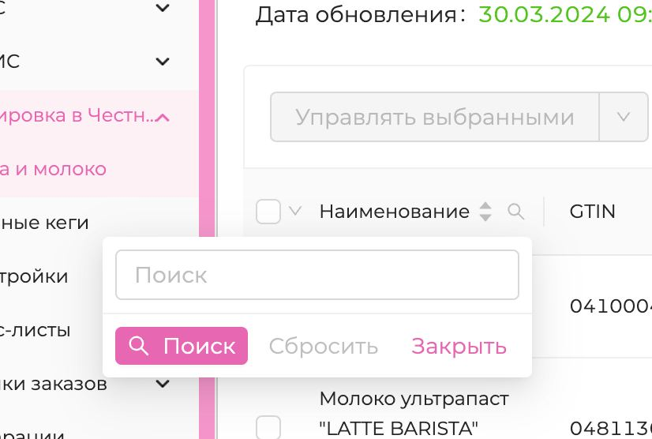
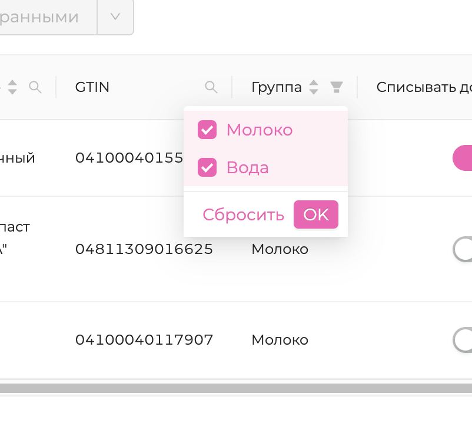

# ТЗ

##### стек:

react 18, typescript, react-query, axios, antd v4

api: https://pokeapi.co/docs/v2#info

##### Описание:

Реализовать табличку-список покемонов с пагинацией посредством antd.

https://pokeapi.co/api/v2/pokemon/{id or name}/
колонки:

- Имя (name),
- стандартный (тут рендерить неизменяемый чекбокс, поле is_default),
- вес (weight),
- вид (species.name)

Каждую строку можно развернуть. при разворачивании дергается запрос https://pokeapi.co/api/v2/pokemon-species/{id or name}/ ,
внутри развернутой строки рисуется форма с задизейбленными полями (инпуты), отображающая поля

- name,
- color.name,
- shape.name,
- generation.name

можно и приветствуется добавление других полей (например дат, селектов, чего угодно) если будет оставаться время и желание

все должно быть строго типизированно. где-нибудь развернуть это (на твое усмотрение)

### UPD:

1. Давай добавим еще возможность **фильтрации по имени**. что-то типа такого

2. Я бы добавил какой-нибудь столбец, в котором выводил бы список чего-то в виде тегов. и дал возможность тоже по ним пофильтровать. как на скрине (там фильтр, но без тегов)

3. Еще у тебя в типе сейчас показывает название покемона. может я тебе неверное поле выдал, посмотри плиз)

# self-Ревью:

Для получения общего количества покемонов, сначал использовал:
https://pokeapi.co/api/v2/pokemon/

Но к сожалению count из этой ручки был не правильным, о чем нашел
https://github.com/PokeAPI/pokeapi/issues/143

Там посоветовали использовать /pokemon-species/?limit=0, что я и сделал

В API вид (species.name) совпадал с Имя (name) заменил столбец на Опыт (base_experience)

Для стобца Тип, взял массив Типов урона/способностей(?) покемона из массива types

## Что можно было бы улучшить:

* Гигантский компонент таблицы разбить на фичи:
  * Вынести отдельно параметры таблицы 
  * Вынести структуру таблицы
  * Вынести поиск, больно он уж громадный
* Типизация:
  * ~~Отказаться или типизировать react-highlight-words~~ нашел типы в npm, -- взял из доки ant из-за любопытства
  * Пересмотреть создание типов и интерфейсов, не до конца уверен, что они оптимальны
* Запросы:
  * Возможно есть более оптимальный способ конфигурации, в рамках этой задачи вроде норм, лишний запросов нет
  * Можно было бы убрать рефетч при фокусе на страницу и обратно, т.к шансы на изменения таблицы минимальны

